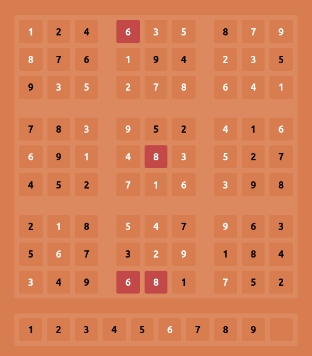

# sudoku-frontend
Multiplayer sudoku build with ReactJs and SocketIo.

[Backend](https://github.com/mDeram/sudoku-backend)

## Running the project in development
```sh
npm run start
```

## Running the project in production
```sh
npm run build
# Remove the homepage field in package.json for this to work
serve -s build/ # Or any other way to serve a static website
```

## Previews
### Settings


### Multiplayer


### Errors


### Success

